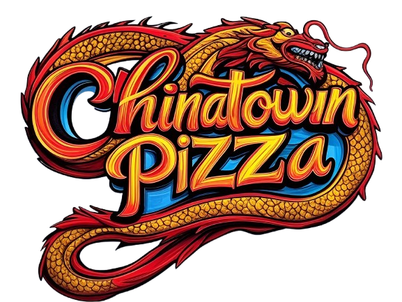

# 🍕 CHINATOWN PIZZA APP

¡Bienvenido a la **APP de CHINATOWN PIZZA**!  
Una aplicación moderna, intuitiva y 100% frontend para que explores el delicioso menú de pizzas de forma rápida y atractiva.

---

## 📦 Instalación y Ejecución

Sigue estos pasos para correr la app en tu entorno local:

1. **Clona el repositorio**  
   ```bash
   git clone https://github.com/juanww20/APP_CHINATOWN_PIZZA.git
   ```

2. **Entra a la carpeta del proyecto**  
   ```bash
   cd APP_CHINATOWN_PIZZA
   ```

3. **Navega a la carpeta principal de la app**  
   ```bash
   cd Pizzeria
   ```

4. **Instala las dependencias necesarias**  
   ```bash
   npm install
   ```

5. **Inicia el servidor de desarrollo**  
   ```bash
   npm run web
   ```
